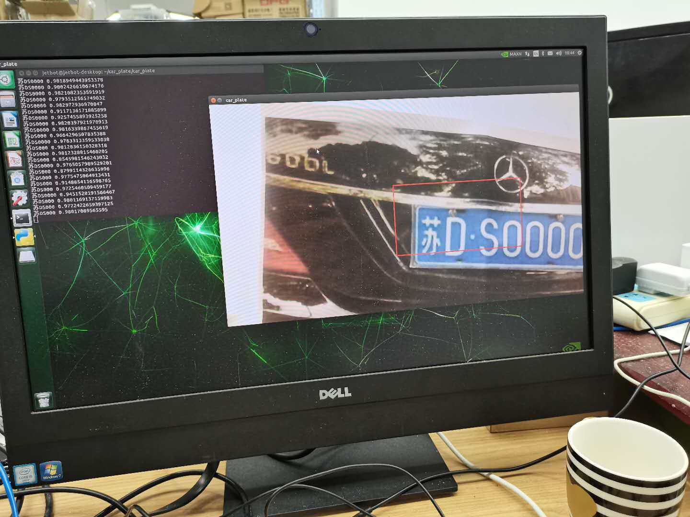

# 车牌识别
这个的车牌识别程序使用的是开源的车牌识别框架hyperlpr实现的，此框架的训练模型的导出格式为caffe,开源的框架的链接地址
<a href="https://github.com/zeusees/HyperLPR">>Windows/Mac/Linux 全平台客户端</a>

## python环境：
python3
## 依赖环境：
opencv 4.1.0(opencv 3.4以上均可)
pillow
numpy
## 目录结构：
model: 包含caffe中的结构和权重模型
hyperlpr.py:模型的加载和主要方法的实现
tabel_chs.py：识别转换的模型映射的数组文件
test.py 识别的入口程序
## 运行过程：
python3 test.py

